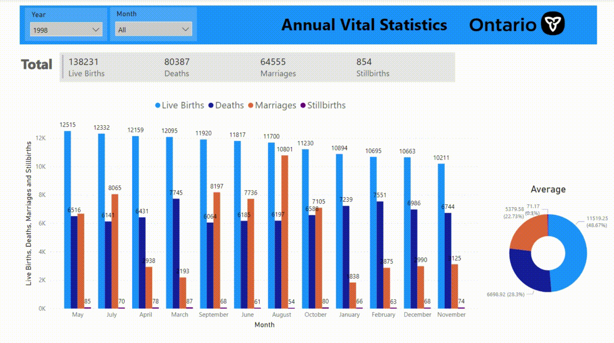

# Ontario-Vital-Events--Interactive-Dashboard
This is an open-access dataset containing the number of births, deaths, marriages, and stillbirths registered by the Registrar General from 1994. 

-- Dataset: https://data.ontario.ca/dataset/vital-events-data-by-month  
-- Date range: January 1, 1994 - December 31, 2022.
-- ETL performed using PowerBI
-- Utilized other provincial data sources for data analysis, including data visualization techniques.

